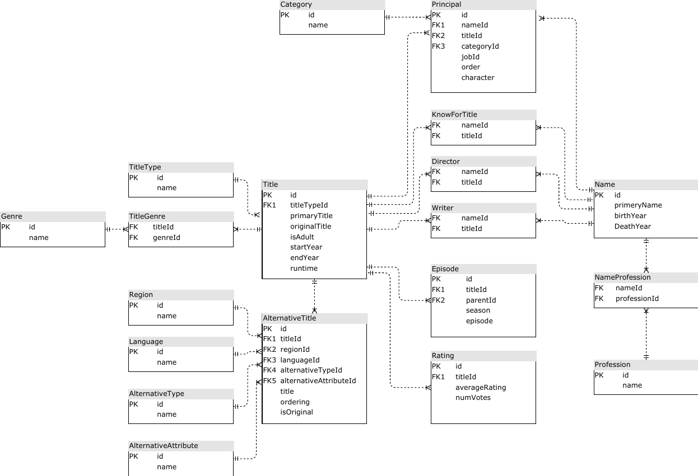
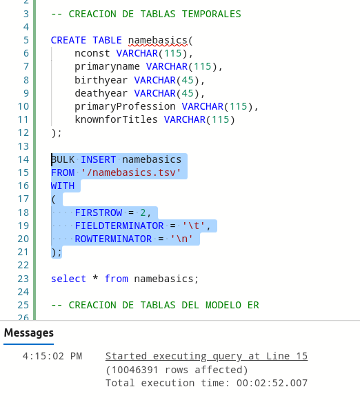
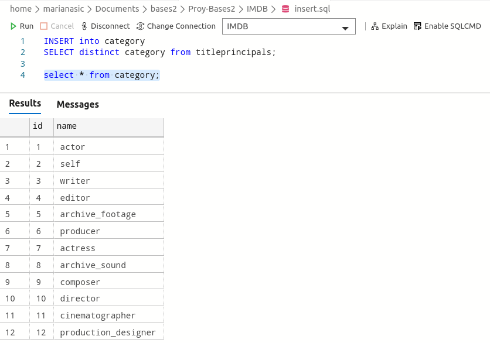
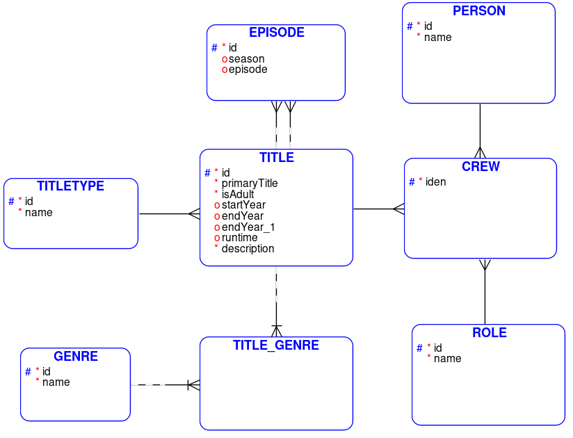
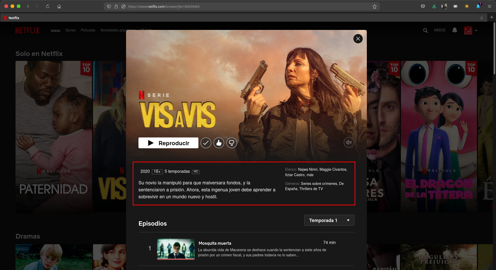
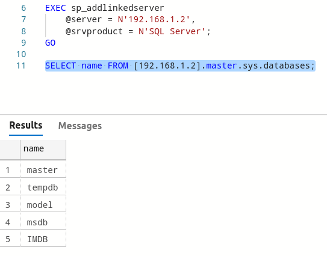
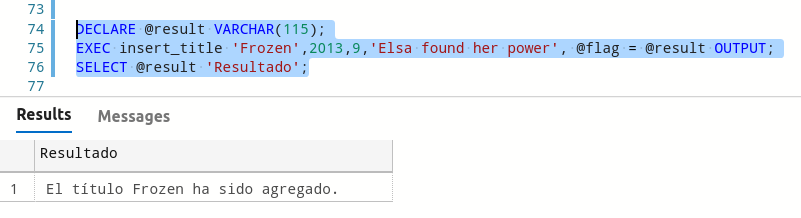

# Proyecto
Proyecto implementado para Bases de Datos 2

Desarrollado por: **_Asunción Mariana Sic Sor_**

# Tabla de Contenido

* [IMDB](#imdb)
    * [Carga de Datos](#carga-datos)
    * [Creación de Tablas](#creación-inserción-tablas)
* [Netflix](#netflix)
    * [Modelado de Datos](#modelado-de-datos)
        * [Explicación de Tablas](#tablas)
    * [Inserción a Netflix](#inserción-a-netflix)
        * [Linked Server](#linked-server)
        * [Stored Procedure](#stored-procedure)
* [Mongo](#mongo)

# IMDB

Esta base de datos se desarrolló en un servidor con Sistema Operativo Arch Linux (Manjaro KFCE)

El modelo Entidad-Relacional es el siguiente



Esta base de datos se ha desarollado en SQL Server y los datos se encuentran en este [enlace](https://drive.google.com/drive/u/1/folders/1FtmfuvnxwSpXAHLT0jTK3bSCRztVrXDr).

## Carga Datos

Para cargar dichos datos, se crea una tabla temporal por cada archivo ```.tsv``` de la siguiente manera

> Para el procedimiento se utiliza el archivo ```namebasics.tsv```

Primero se crea la tabla temporal para almacenar los datos

```sql
CREATE TABLE namebasics(
    nconst VARCHAR(115),
    primaryname VARCHAR(115),
    birthyear VARCHAR(45),
    deathyear VARCHAR(45),
    primaryProfession VARCHAR(115),
    knownforTitles VARCHAR(115)
);
```

Luego se insertan los datos con la siguiente instrucción
```sql
BULK INSERT namebasics
FROM '/namebasics.tsv'
WITH
(
    FIRSTROW = 2,
    FIELDTERMINATOR = '\t',
    ROWTERMINATOR = '\n'
);
```

Y los datos se cargaran



Dicho procedimiento se ejecuta para todos los archivos proporcionados

## Creación-Inserción Tablas

Luego se crean las tablas según el [modelo entidad/relación](#modelo-er) correspondiente.

>Por ejemplo, se muestra con la tabla ```Category```

Se crea la tabla

```sql
create table genre(
    id int IDENTITY(1,1),
    name VARCHAR(75),
    PRIMARY KEY (id)
);
```

Luego con una consulta a la base de datos de la tabla temporal ```titleprincipals``` se inserta a la tabla

```sql
INSERT into category
SELECT distinct category from titleprincipals;
```

Y ya quedan insertados los datos en la base de datos



De esta manera se insertan los datos en la base de datos.

El script de la inserción en la base de datos se encuentra en el archivo [```IMDB/insert.sql```](IMDB/insert.sql)

# Netflix
Para la base de datos de este sistema, se desarrolló en SQL Server en una máquina virtual con [Xubuntu](https://xubuntu.org/) como Sistema Operativo

## Modelado de Datos

El modelo entidad relación surge a partir del diagrama de [IMDB](#imdb), pero para la base de datos de Netflix se reduce al siguiente diagrama



> Su modelo relacional se encuentra [acá](img/er-rel-net.png)

### Tablas

|Tabla|Descripción|
|:--:|:--:|
|Genre|En esta tabla se almacenan los géneros posibles de algún título|
|TitleType|Se almacenan los posibles tipos de un título. Ej. Show, película, serie, etc.|
|Title|En esta tabla se almacena la información relevante de un título y en ella también hace referencia con llave foránea hacia los posibles tipos de títulos y géneros que pueda clasificarse un mismo título. El valor de esta llave primaria es exactamente igual a la de IMDB para poder vincular su rating|
|Title_Genre|A esta tabla caen todos los géneros posibles en los que pueda clasificarse un mismo título.|
|Episode|En dado caso el título sea una serie, acá se encuentra a detalle su único o varios episodios correspondientes a un mismo título|
|Person|Esta tabla almacena todas las personas que pueden verse enrrollada en algún título|
|Role|Acá se especifican los posibles roles que las personas pueden ejercer. Éstos pueden ser actor, actriz, director o escritor|
|Crew|Acá se definen todas las personas y rol que ejercen en un mismo título|

Se eligió dicho modelo basándose en los datos que actualmente muestra el catálogo de [Netflix &copy;](netflix.com)



> _**Fuente:** Esta imagen es propiedad de [Netflix &copy;](www.netflix.com) y en ella se muestra el título de [Vis a Vis](https://www.imdb.com/title/tt4524056/)_

La creación de las tablas descritas se encuentra en [```Netflix/create.sql```](Netflix/create.sql)

## Inserción a Netflix

Para estar insertando nuevas películas en la base de datos de Netflix, se necesita un procedimiento almacenado y que la película que se vaya insertando cree un vínculo entre la base de datos IMDB con la de Netflix, dado que ambas están en diferente servidor, se crea un [Linked Server](https://docs.microsoft.com/en-us/sql/relational-databases/linked-servers/create-linked-servers-sql-server-database-engine?view=sql-server-linux-ver15#TsqlProcedure) para conectar entre servidores.

### Linked Service

El servicio enlazado se crea con la siguiente instrucción

```sql
USE [NETFLIX]
GO

EXEC sp_addlinkedserver
    @server = N'192.168.1.2',
    @srvproduct = N'SQL Server';
GO
```

La dirección IP ```192.168.1.2``` pertenece al servidor que aloja la base de datos de IMDB. Para verificar que se haya enlazado correctamente, se ejecuta la consulta 

```sql
SELECT name FROM [192.168.1.2].master.sys.databases;
```

Para rectificar que entre las bases de datos del otro servidor, se encuentre la de IMDB




La inserción de datos simples como lo son las personas, los roles, las categorías y tipos de título se encuentran en el archivo [```insert.sql```](Netflix/insert.sql) con el servicio enlazado.

### Stored Procedure

Para llenar las tablas ```title```, ```episode```, ```title_genre``` y ```crew``` se hace uso de un procedimiento almacenado

Se comienza creando y asignando el título de ```insert_title``` y con parámetros:

|Parámetro|Descripción|
|:--:|:--:|
|@titulo|Es de tipo ```varchar```, contiene el nombre del título que se desea almacenar|
|@anio|Es de tipo ```int```, contiene el año de inicio, osea el año en el que se inició o estrenó el título a almacenar|
|@tipo_titulo|Es de tipo ```int```, contiene el tipo de título que es (ya sea, tvSerie, show, movie, etc)|
|@desc|Es de tipo ```varchar```, contiene una breve descripción del título que se va a almacenar|

Se crea el procedimiento y sus parámetros:
```sql
CREATE PROCEDURE insert_title 
    @titulo varchar(600), 
    @anio int, 
    @tipo_titulo int, 
    @desc varchar(5000)
```

Luego se hace uso de una variable ```@id_title``` la cual almacena el id del título en dado ya esté registrado en la base de datos de IMDB

```sql
DECLARE @id_title VARCHAR(115);

SET @id_title = (
    SELECT TOP 1 tl.id FROM [192.168.1.2].IMDB.dbo.title tl
    WHERE UPPER(tl.primaryTitle) = UPPER(@titulo) AND tl.startYear = @anio AND tl.titleTypeId = @tipo_titulo
);
```

Se hace la respectiva verificación si la variable es nula o no (es decir, si el título existe o no). Si no existe, se sale del procedimiento

```sql
IF @id_title IS NULL
    BEGIN
        -- SIGNIFICA QUE EL TITULO NO ESTA EN EL CATALOGO DE IMDB
        RETURN(1)
    END
```

En dado caso ya exista, se inserta en las tablas respectivas que se han mencionado antes

```sql
ELSE
    BEGIN
        -- INSERTAR A LA TABLA TITLE
        INSERT INTO title(id, primaryTitle, isAdult, startYear, endYear, runtime, [description], titleTypeId)
        SELECT TOP 1 tl.id, tl.primaryTitle, tl.isAdult, tl.startYear, tl.endYear, tl.runtime, @desc, tl.titleTypeId
        FROM [192.168.1.2].IMDB.dbo.title tl WHERE tl.id = @id_title;

        -- INSERTAR A LA TABLA CREW
        INSERT INTO crew(titleId, personId, roleId)
        SELECT TOP 3 pr.titleId, pr.nameId, role.id
        FROM [192.168.1.2].IMDB.dbo.principal pr INNER JOIN [192.168.1.2].IMDB.dbo.category cg ON pr.categoryId = cg.id
        INNER JOIN role ON role.name = cg.name
        WHERE pr.titleId = @id_title AND (cg.name = 'actor' OR cg.name = 'actress');

        INSERT INTO crew(titleId, personId, roleId)
        SELECT TOP 1 dr.titleId, dr.nameId, role.id
        FROM [192.168.1.2].IMDB.dbo.director dr, role 
        WHERE dr.titleId = @id_title AND role.name = 'director';

        INSERT INTO crew(titleId, personId, roleId)
        SELECT TOP 1 dr.titleId, dr.nameId, role.id
        FROM [192.168.1.2].IMDB.dbo.director dr, role 
        WHERE dr.titleId = @id_title AND role.name = 'writer';

        -- INSERTAR A LA TABLA EPISODE
        IF (SELECT count(*) FROM [192.168.1.2].IMDB.dbo.episode ep WHERE ep.parentId = @id_title) > 0
            BEGIN
                INSERT INTO episode(titleId, parentId, season, episode)
                SELECT ep.titleId, ep.parentId, ep.season, ep.episode
                FROM [192.168.1.2].IMDB.dbo.episode ep WHERE ep.parentId = @id_title;
            END

        RETURN(0)
    END
```

El procedimiento almacenado completo se encuentra en el archivo [```stored.sql```](Netflix/stored.sql)

Luego ya solo se ejecuta con la instrucción

```sql
EXEC insert_title 'Frozen',2013,9,'Elsa found her power';
```

