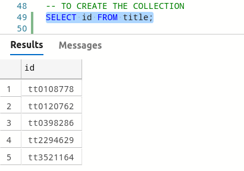

# Proyecto
Proyecto implementado para Bases de Datos 2

Desarrollado por: **_Asunción Mariana Sic Sor_**

# Tabla de Contenido

* [Arquitectura](#arquitectura)
* [IMDB](#imdb)
    * [Carga de Datos](#carga-datos)
    * [Creación de Tablas](#creación-inserción-tablas)
* [Netflix](#netflix)
    * [Modelado de Datos](#modelado-de-datos)
        * [Explicación de Tablas](#tablas)
    * [Inserción a Netflix](#inserción-a-netflix)
        * [Linked Server](#linked-server)
        * [Stored Procedure](#stored-procedure)
* [Mongo](#mongo)
    * [Esquema](#esquema)
    * [Insertar datos](#insertar-datos)
        * [Recuperar de SQL](#recuperar-de-sql)
        * [Ingresar a Mongo](#ingresar-a-mongo)
    * [Demonio](#demoniomo)

# Arquitectura

La arquitectura en este proyecto es la siguiente


|Sistema Operativo|Dirección IP|Motor Base de Datos|Descripción|
|:--:|:--:|:--:|:--:|
|Arch Linux|192.168.1.2|SQL Server|Máquina para la base de datos de ```IMDB```, se trabajón en la máquina HOST|
|Xubuntu|192.168.1.31|SQL Server|Máquina virtual en [Virtual Box](https://www.virtualbox.org/) para la base de datos de ```Netflix```|
|Ubuntu|3.21.100.69|Mongo DB|Máquina virtual en [AWS](https://aws.amazon.com/) (EC2) para la base de datos No Relacional|

Algunas herramientas adicionales que se trabajaron fueron [Azure Data Studio](https://docs.microsoft.com/en-us/sql/azure-data-studio/download-azure-data-studio?view=sql-server-ver15) para trabajar con SQL Server y [MongoDB Compass](https://www.mongodb.com/products/compass) para visualizar datos de Mongo.

# IMDB

Esta base de datos se desarrolló en un servidor con Sistema Operativo Arch Linux (Manjaro XFCE)

El modelo Entidad-Relacional es el siguiente


Esta base de datos se ha desarollado en SQL Server y los datos se encuentran en este [enlace](https://drive.google.com/drive/u/1/folders/1FtmfuvnxwSpXAHLT0jTK3bSCRztVrXDr).

## Carga Datos

Para cargar dichos datos, se crea una tabla temporal por cada archivo ```.tsv``` de la siguiente manera

> Para el procedimiento se utiliza el archivo ```namebasics.tsv```

Primero se crea la tabla temporal para almacenar los datos

```sql
CREATE TABLE namebasics(
    nconst VARCHAR(115),
    primaryname VARCHAR(115),
    birthyear VARCHAR(45),
    deathyear VARCHAR(45),
    primaryProfession VARCHAR(115),
    knownforTitles VARCHAR(115)
);
```

Luego se insertan los datos con la siguiente instrucción
```sql
BULK INSERT namebasics
FROM '/namebasics.tsv'
WITH
(
    FIRSTROW = 2,
    FIELDTERMINATOR = '\t',
    ROWTERMINATOR = '\n'
);
```

Y los datos se cargaran


Dicho procedimiento se ejecuta para todos los archivos proporcionados

## Creación-Inserción Tablas

Luego se crean las tablas según el [modelo entidad/relación](#modelo-er) correspondiente.

>Por ejemplo, se muestra con la tabla ```Category```

Se crea la tabla

```sql
create table genre(
    id int IDENTITY(1,1),
    name VARCHAR(75),
    PRIMARY KEY (id)
);
```

Luego con una consulta a la base de datos de la tabla temporal ```titleprincipals``` se inserta a la tabla

```sql
INSERT into category
SELECT distinct category from titleprincipals;
```

Y ya quedan insertados los datos en la base de datos


De esta manera se insertan los datos en la base de datos.

El script de la inserción en la base de datos se encuentra en el archivo [```IMDB/insert.sql```](IMDB/insert.sql)

# Netflix
Para la base de datos de este sistema, se desarrolló en SQL Server en una máquina virtual con [Xubuntu](https://xubuntu.org/) como Sistema Operativo

## Modelado de Datos

El modelo entidad relación surge a partir del diagrama de [IMDB](#imdb), pero para la base de datos de Netflix se reduce al siguiente diagrama


> Su modelo relacional se encuentra [acá](img/er-rel-net.png)

### Tablas

|Tabla|Descripción|
|:--:|:--:|
|Genre|En esta tabla se almacenan los géneros posibles de algún título|
|TitleType|Se almacenan los posibles tipos de un título. Ej. Show, película, serie, etc.|
|Title|En esta tabla se almacena la información relevante de un título y en ella también hace referencia con llave foránea hacia los posibles tipos de títulos y géneros que pueda clasificarse un mismo título. El valor de esta llave primaria es exactamente igual a la de IMDB para poder vincular su rating|
|Title_Genre|A esta tabla caen todos los géneros posibles en los que pueda clasificarse un mismo título.|
|Episode|En dado caso el título sea una serie, acá se encuentra a detalle su único o varios episodios correspondientes a un mismo título|
|Person|Esta tabla almacena todas las personas que pueden verse enrrollada en algún título|
|Role|Acá se especifican los posibles roles que las personas pueden ejercer. Éstos pueden ser actor, actriz, director o escritor|
|Crew|Acá se definen todas las personas y rol que ejercen en un mismo título|

Se eligió dicho modelo basándose en los datos que actualmente muestra el catálogo de [Netflix &copy;](netflix.com)


> _**Fuente:** Esta imagen es propiedad de [Netflix &copy;](www.netflix.com) y en ella se muestra el título de [Vis a Vis](https://www.imdb.com/title/tt4524056/)_

La creación de las tablas descritas se encuentra en [```Netflix/create.sql```](Netflix/create.sql)

## Inserción a Netflix

Para estar insertando nuevas películas en la base de datos de Netflix, se necesita un procedimiento almacenado y que la película que se vaya insertando cree un vínculo entre la base de datos IMDB con la de Netflix, dado que ambas están en diferente servidor, se crea un [Linked Server](https://docs.microsoft.com/en-us/sql/relational-databases/linked-servers/create-linked-servers-sql-server-database-engine?view=sql-server-linux-ver15#TsqlProcedure) para conectar entre servidores.

### Linked Service

El servicio enlazado se crea con la siguiente instrucción

```sql
USE [NETFLIX]
GO

EXEC sp_addlinkedserver
    @server = N'192.168.1.2',
    @srvproduct = N'SQL Server';
GO
```

La dirección IP ```192.168.1.2``` pertenece al servidor que aloja la base de datos de IMDB. Para verificar que se haya enlazado correctamente, se ejecuta la consulta 

```sql
SELECT name FROM [192.168.1.2].master.sys.databases;
```

Para rectificar que entre las bases de datos del otro servidor, se encuentre la de IMDB


La inserción de datos simples como lo son las personas, los roles, las categorías y tipos de título se encuentran en el archivo [```insert.sql```](Netflix/insert.sql) con el servicio enlazado.

### Stored Procedure

Para llenar las tablas ```title```, ```episode```, ```title_genre``` y ```crew``` se hace uso de un procedimiento almacenado

Se comienza creando y asignando el título de ```insert_title``` y con parámetros:

|Parámetro|Descripción|
|:--:|:--:|
|@titulo|Es de tipo ```varchar```, contiene el nombre del título que se desea almacenar|
|@anio|Es de tipo ```int```, contiene el año de inicio, osea el año en el que se inició o estrenó el título a almacenar|
|@tipo_titulo|Es de tipo ```int```, contiene el tipo de título que es (ya sea, tvSerie, show, movie, etc)|
|@desc|Es de tipo ```varchar```, contiene una breve descripción del título que se va a almacenar|
|@flag|Es de tipo ```varchar```, parámetro de salida para imprimir el resultado del procedimiento almacenado|

Se crea el procedimiento y sus parámetros:
```sql
CREATE PROCEDURE insert_title 
    @titulo varchar(600), 
    @anio int, 
    @tipo_titulo int, 
    @desc varchar(5000)
    @flag varchar(115) OUTPUT
```

Luego se hace uso de una variable ```@id_title``` la cual almacena el id del título en dado ya esté registrado en la base de datos de IMDB

```sql
DECLARE @id_title VARCHAR(115);

SET @id_title = (
    SELECT TOP 1 tl.id FROM [192.168.1.2].IMDB.dbo.title tl
    WHERE UPPER(tl.primaryTitle) LIKE UPPER(@titulo) AND tl.startYear = @anio AND tl.titleTypeId = @tipo_titulo
);
```

Se hace la respectiva verificación si la variable es nula o no (es decir, si el título existe o no). Si no existe, se sale del procedimiento

```sql
IF @id_title IS NULL
    BEGIN
        -- SIGNIFICA QUE EL TITULO NO ESTA EN EL CATALOGO DE IMDB
        SET @flag = 'El título ' + @titulo + ' no se ha encontrado.';
        RETURN
    END
```

En dado caso ya exista, se inserta en las tablas respectivas que se han mencionado antes.

Además se vuelve a verificar que no exista el título a agregar en la base de datos de Netflix 

```sql
IF (SELECT primaryTitle FROM title t WHERE t.id = @id_title) IS NULL
    BEGIN
        -- INSERTAR A LA TABLA TITLE
        INSERT INTO title(id, primaryTitle, isAdult, startYear, endYear, runtime, [description], titleTypeId)
        SELECT TOP 1 tl.id, tl.primaryTitle, tl.isAdult, tl.startYear, tl.endYear, tl.runtime, @desc, tl.titleTypeId
        FROM [192.168.1.2].IMDB.dbo.title tl WHERE tl.id = @id_title;

        -- INSERTAR A LA TABLA CREW
        INSERT INTO crew(titleId, personId, roleId)
        SELECT TOP 3 pr.titleId, pr.nameId, role.id
        FROM [192.168.1.2].IMDB.dbo.principal pr INNER JOIN [192.168.1.2].IMDB.dbo.category cg ON pr.categoryId = cg.id
        INNER JOIN role ON role.name = cg.name
        WHERE pr.titleId = @id_title AND (cg.name = 'actor' OR cg.name = 'actress');

        INSERT INTO crew(titleId, personId, roleId)
        SELECT TOP 1 dr.titleId, dr.nameId, role.id
        FROM [192.168.1.2].IMDB.dbo.director dr, role 
        WHERE dr.titleId = @id_title AND role.name = 'director';

        INSERT INTO crew(titleId, personId, roleId)
        SELECT TOP 1 dr.titleId, dr.nameId, role.id
        FROM [192.168.1.2].IMDB.dbo.director dr, role 
        WHERE dr.titleId = @id_title AND role.name = 'writer';

        -- INSERT TITLE_GENRE
        INSERT INTO title_genre(genreId, titleId) VALUES (@tipo_titulo, @id_title);

        -- INSERTAR A LA TABLA EPISODE
        IF (SELECT count(*) FROM [192.168.1.2].IMDB.dbo.episode ep WHERE ep.parentId = @id_title) > 0
            BEGIN
                INSERT INTO episode(titleId, parentId, season, episode)
                SELECT ep.titleId, ep.parentId, ep.season, ep.episode
                FROM [192.168.1.2].IMDB.dbo.episode ep WHERE ep.parentId = @id_title;
            END

        SET @flag = 'El título ' + @titulo + ' ha sido agregado.';
        RETURN
    END
```

Y si ya ha sido agregado antes, no se agrega nada en la base de datos

```sql
ELSE
    BEGIN
        SET @flag = 'El título ' + @titulo + ' ya ha sido agregado antes.';
        RETURN
    END
```

El procedimiento almacenado completo se encuentra en el archivo [```stored.sql```](Netflix/stored.sql)

Luego ya solo se ejecuta con la instrucción

```sql
DECLARE @result VARCHAR(115);
EXEC insert_title 'Frozen',2013,9,'Elsa found her power', @flag = @result OUTPUT;
SELECT @result 'Resultado';
```


# Mongo

## Esquema

En base al [modelo entidad relación](#modelado-de-datos) de Netflix, la colección en Mongo del mismo queda de la siguiente manera:

```json
{
    "_id":"tt2294629",
    "primaryTitle":"Frozen",
    "isAdult":0,
    "startYear":2013,
    "endYear":0,
    "runtime":102,
    "description":"Elsa found her power",
    "titleType":"movie",
    "cast": ["Kristen Bell","Idina Menzel","Josh Gad"],
    "director":"Jennifer Lee",
    "writer":"Jennifer Lee",
    "genre": ["Comedy","Animation","Adventure"],
    "rating": {
        "averageRating":7,
        "numVotes":552120
    }
}
```

## Insertar Datos

Para la inserción de datos en Mongo DB, se ha utilizado como lenguaje de programación Python con ayuda de las siguientes librerías

|Librería|Descripción|
|:--:|:--:|
|[pymssql](https://pypi.org/project/pymssql/)|Para conectar la base de datos de Netflix en SQL Server con Python|
|[pymongo](https://pymongo.readthedocs.io/en/stable/tutorial.html)|Para conectar la base de datos de Mongo DB con Python|
|[daemonize](https://daemonize.readthedocs.io/en/latest/)|Para iniciar un demonio y que actualice los datos de SQL Server a Mongo. Este proceso se detalla más [adelante](#demonio)|

### Recuperar de SQL

Primero se recuperan los códigos de los títulos existentes en Netflix 

```sql
SELECT id FROM title;
```



Sabiendo que la anterior consulta devuelve correctamente los códigos de los títulos existente se crea el método ```all_titles```

```python
def all_titles():
    cursor.execute('SELECT id FROM title;')
    titles = []
    row = cursor.fetchone()
    while row:
        titles.append(str(row[0]))
        row = cursor.fetchone()

    return titles
```

El cual devuelve en un arreglo todos los códigos. Esto facilita la inserción ya que luego solo se recorre el arreglo para obtener código en código todos los títulos.

Luego se realizan métodos para recuperar en cada tabla de SQL mandando como parámetro el código de cada título

#### Tabla "title"

Con la consulta 

```sql
SELECT t.id, t.primaryTitle, t.isAdult, t.startYear, t.endYear, t.runtime, t.[description], tp.name 
FROM title t INNER JOIN titletype tp ON t.titleTypeId = tp.id WHERE t.id = 'tt2294629';
```


Se obtienen los detalles del títulos y se retornan en un arreglo

```py
def detailed_title(id_title):
    cursor.execute("SELECT t.id, t.primaryTitle, t.isAdult, t.startYear, t.endYear, t.runtime, t.[description], tp.name FROM title t INNER JOIN titletype tp ON t.titleTypeId = tp.id WHERE t.id = '" + str(id_title) + "';")
    return cursor.fetchone()
```

#### Tabla "Crew"

Con las consultas

```sql
SELECT p.name FROM crew c INNER JOIN person p ON c.personId = p.id INNER JOIN role r ON c.roleId = r.id
WHERE c.titleId = 'tt2294629' AND (r.name = 'actress' OR r.name = 'actor');

SELECT p.name FROM crew c INNER JOIN person p ON c.personId = p.id INNER JOIN role r ON c.roleId = r.id WHERE c.titleId = 'tt2294629' AND r.name = 'director';

SELECT p.name FROM crew c INNER JOIN person p ON c.personId = p.id INNER JOIN role r ON c.roleId = r.id
WHERE c.titleId = 'tt2294629' AND r.name = 'writer';
```


Se obtiene el campo de cast que es un arreglo y el dato del director y escritor de un título

```py
def cast_table(id_title):
    cursor.execute("SELECT p.name FROM crew c INNER JOIN person p ON c.personId = p.id INNER JOIN role r ON c.roleId = r.id WHERE c.titleId = '" + str(id_title) + "' AND (r.name = 'actress' OR r.name = 'actor');")
    cast = []
    row = cursor.fetchone()
    while row:
        cast.append(str(row[0]))
        row = cursor.fetchone()
    return cast
```

Y para el director y escritor, un método que además de recibir el código del título como parámetro recibe si se desea obtener el director o escritor

```py
def get_creator(id_title, role):
    cursor.execute("SELECT p.name FROM crew c INNER JOIN person p ON c.personId = p.id INNER JOIN role r ON c.roleId = r.id WHERE c.titleId = '" + id_title + "' AND r.name = '" + role + "';")
    return cursor.fetchone()[0]
```

#### Tabla "genre"

Con la consulta

```sql
SELECT g.name FROM title_genre tg INNER JOIN genre g ON tg.genreId = g.id WHERE tg.titleId = 'tt2294629';
```


Se crea método para regresar los géneros en un sólo arreglo

```py
def get_genres(id_title):
    cursor.execute("SELECT g.name FROM title_genre tg INNER JOIN genre g ON tg.genreId = g.id WHERE tg.titleId = '" + str(id_title) + "';")
    genres = []
    row = cursor.fetchone()
    while row:
        genres.append(str(row[0]))
        row = cursor.fetchone()
    return genres
```

#### Tabla "rating"

Esta tabla no pertenece a la base de datos de Netflix, por lo que se debe acceder directamente a la de IMDB con el [servicio enlazado](#linked-server) creado anteriormente con la siguiente consulta

```sql
SELECT r.averageRating, r.numVotes FROM [192.168.1.2].IMDB.dbo.rating r WHERE r.titleId = 'tt2294629';
```


La anterior consulta devuelve solo dos campos por lo que se realiza un método que devuelva éstos dos métodos en un arreglo casteados a su propio tipo de dato.

```py
def get_rating(id_title):
    cursor.execute("SELECT r.averageRating, r.numVotes FROM [192.168.1.2].IMDB.dbo.rating r WHERE r.titleId = '" + id_title + "';")
    row = cursor.fetchone()
    return [float(row[0]), int(row[1])]
```

### Ingresar a Mongo

Primero se conecta al cliente de mongo que es una máquina virtual de Ubuntu en la nube cuya dirección IP es ```3.21.100.69``` y el puerto para Mongo es ```27017```

```py
# Conectar a mongo
client = MongoClient(port=27017, host="3.21.100.69")

# Seleccionar base de datos y coleccion
db = client['Netflix']
collection = db.titles
```

Luego se crea un método ```insert_data``` que llama a los métodos descritos anteriormente que recuperan datos de la base de datos relacional para formar el objeto JSON

```py
def insert_data():
    for single_title in main.all_titles():
        # Obtener lista de codigos actuales en la base de datos de Netflix
        details = main.detailed_title(single_title)
        # Crear el objeto JSON
        title = {
            "_id": details[0],
            "primaryTitle": details[1],
            "isAdult": details[2],
            "startYear": details[3],
            "endYear": details[4],
            "runtime": details[5],
            "description": details[6],
            "titleType": details[7],
            "cast": main.cast_table(single_title),
            "director": main.get_creator(single_title, 'director'),
            "writer": main.get_creator(single_title, 'writer'),
            "genre": main.get_genres(single_title),
            "rating": {
                "averageRating": main.get_rating(single_title)[0],
                "numVotes": main.get_rating(single_title)[1]
            }
        }
        # Insertar objeto a Mongo
        collection.insert_one(title)
```

 De esta manera, los títulos quedan almacenados en la base de datos de Mongo

## Demonio

Para crear el demonio, se utiliza la librería detallada anteriormente.

Primero se especifica la ruta del archivo PID

```py
from daemonize import Daemonize

pid = "/tmp/collect-mongo.pid"
```

Luego se crea el método que el demonio va a ejecutar

```py
def first():
    while True:
        collection.drop()
        insert_data()
        sleep(71)
```

El método se va a ejecutar indeterminadas veces y primero elimina los datos existentes en mongo, luego vuelve a insertar todos los registros y hace una pausa de 71 segundos.

Finalmente, se hace instancia de la clase ```Daemonize``` que recibe como parámetro el nombre de la aplicación, la ruta del archivo PID y el método de la acción que va a realizar el demonio

```py
daemon = Daemonize(app="run_netflix", pid=pid, action=first())
daemon.start()
```

Para ver los datos, se puede conectar el cliente de Mongo a MongoDB Compass para visualizar

